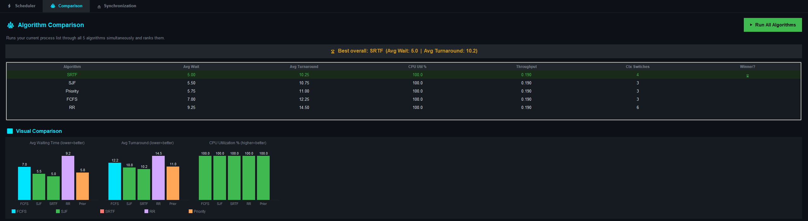
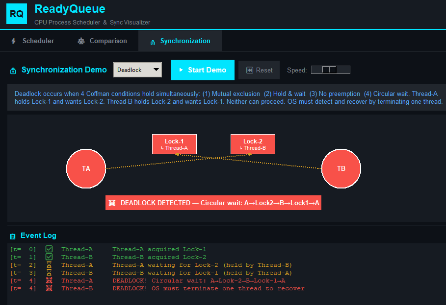
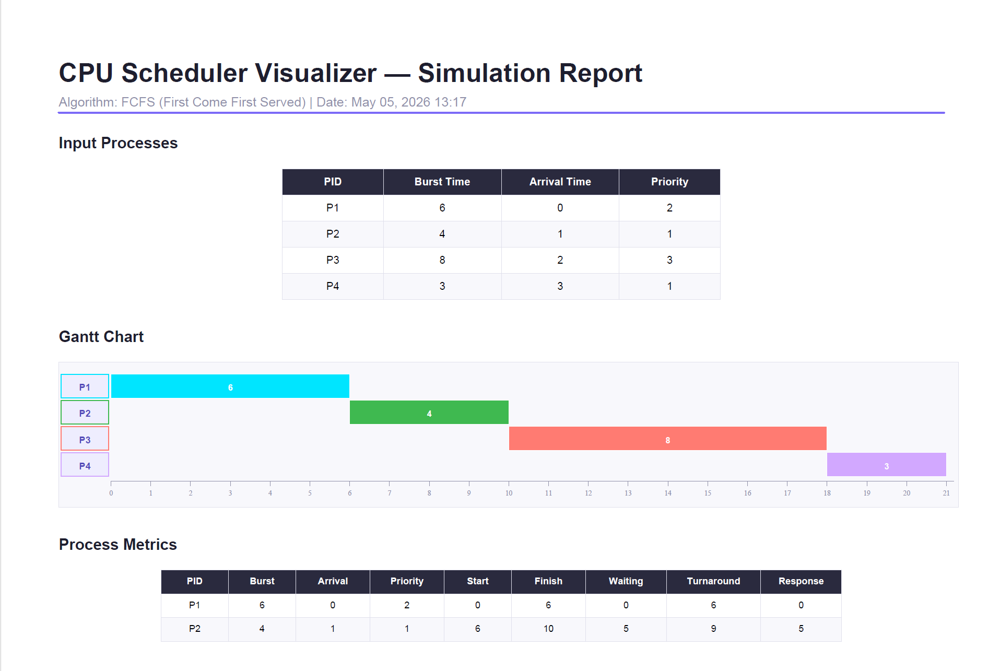

ReadyQueue — CPU Process Scheduler & Sync Visualizer

I built this because I was tired of drawing Gantt charts by hand.
Now you can just type in your processes, pick an algorithm, and watch it run.

Built with Python and tkinter — no frameworks, no extra installations, just pure Python.


## Demo Video

**[Watch it in action](YOUR_YOUTUBE_LINK_HERE)**


## What is this exactly?

You know how in OS class you have to manually draw Gantt charts and calculate waiting times by hand? This app does all of that for you — but animated, step by step, so you can actually see what the algorithm is doing and why.

You type in your processes, pick an algorithm like FCFS or Round Robin, hit Run, and the app draws the Gantt chart live while calculating all the metrics automatically.

But it does more than just scheduling. There is also a whole Synchronization tab where you can watch a Deadlock form in real time, see a Race Condition happen live, and understand Mutex locks and Producer/Consumer with actual animations — not just text descriptions.

And if you want to know which algorithm is best for your processes, the Comparison tab runs all of them at once and picks a winner.


## What can it do?

### Scheduler Tab

| Feature | What it does |
|--------|-------------|
| 6 Scheduling Algorithms | FCFS, SJF, SRTF, Round Robin, Priority, Priority + Aging |
| Animated Gantt Chart | Draws the chart live, frame by frame, as the simulation plays |
| Step-by-Step Explainer | Click Next Step, and it tells you exactly WHY that process was picked |
| Starvation Detection | Shows a red warning when a process has been waiting too long |
| Metrics Table | Shows waiting time, turnaround time, and response time for every process |
| Summary Cards | Avg wait time, CPU utilization, throughput, context switches — all in one glance |
| Priority Aging | Automatically boosts low-priority processes so they never wait forever |

### Comparison Tab

| Feature | What it does |
|--------|-------------|
| Run All at Once | Runs all 5 algorithms on your processes at the same time |
| Winner Detection | Puts a trophy on the best performing algorithm |
| Bar Charts | Shows the difference visually — not just numbers |

### Synchronization Tab

| Feature | What it does |
|--------|-------------|
| Mutex Lock Demo | Watch 3 threads fight over a lock — see who gets blocked and who gets in |
| Producer / Consumer | A buffer fills up, and empties live with semaphore logic |
| Deadlock Demo | Watch two threads get stuck waiting on each other — circular wait animated |
| Race Condition | See what happens when two threads write at the same time without sync |
| Event Log | Every event logged with timestamps and colour coding |

### Works Everywhere

| Feature | What it does |
|--------|-------------|
| Save & Load | Save your process list to a file and reload it anytime |
| Export PDF | One click to get a full professional report — Gantt chart, metrics, everything |
| Resizable Panels | Drag the dividers to make any section bigger or smaller |
| Live Clock | Shows the current time in the top bar, updates every second |
| Status Bar | Always tells you what the app is doing right now |
| Dark Theme | Deep navy background with electric cyan — looks clean |

---

## Files in this project

```
ReadyQueue/
│
├── main.py          # The whole UI and animation — this is what you run
├── process.py       # Defines what a process is (like a PCB in a real OS)
├── scheduler.py     # All 6 scheduling algorithms live here
├── sync_demo.py     # The mutex, deadlock, semaphore, and race condition logic
├── explainer.py     # Figures out WHY each scheduling decision was made
├── pdf_export.py    # Builds the PDF report
└── README.md        # You are here
```

---

## How to run it

It is easier than it looks. Just follow these steps one by one.

### Step 1 — Check if Python is installed

Open Command Prompt (press Win + R, type cmd, hit Enter) and type:

```bash
python --version
```

If you see Python 3. x.x, you are good. If you get an error, go to python.org/downloads, download Python, and during install, make sure to tick "Add Python to PATH" — that checkbox matters.

### Step 2 — Download this project

Click the green Code button at the top of this page, then Download ZIP, then extract it anywhere on your PC.

Or if you have Git installed:

```bash
git clone https://github.com/YOUR_USERNAME/ReadyQueue.git
cd ReadyQueue
```

### Step 3 — Install one library (just this once)

```bash
pip install reportlab
```

This is only needed for the PDF export feature. Everything else is already part of Python — nothing else to install.

### Step 4 — Run the app

```bash
python main.py
```

That is it. The ReadyQueue window will open maximized with 4 sample processes already loaded, so you can test it immediately.

---

## First time using it? Start here

1. The app opens with 4 sample processes already added — you do not need to type anything
2. Make sure FCFS is selected on the left
3. Click RUN SIMULATION
4. Watch the Gantt chart draw itself
5. Look at the metrics table below — it shows waiting time and turnaround time for each process
6. Try Step Mode — this lets you go one step at a time and explains every decision
7. Switch to the Comparison tab and click Run All Algorithms — see which one wins
8. Go to the Synchronization tab and try the Deadlock demo — it is the most interesting one
9. When you are done, click Export PDF Report to save everything as a PDF

---
[Gantt Chart](screenshots/screenshotsgantt.png)








## If something is not working?

| Problem | What to do |
|---------|------------|
| python not recognized | Try python3 main.py or reinstall Python and check Add to PATH |
| ModuleNotFoundError: reportlab | Run pip install reportlab in Command Prompt |
| ModuleNotFoundError: explainer | All 6 .py files need to be in the same folder |
| ModuleNotFoundError: pdf_export | Same — keep all files together in one folder |
| Window does not appear | Do not double-click the file — run it from Command Prompt |
| PDF is blank | You need to run a simulation first before exporting |

---

## The 6 algorithms used here — quick explanation of all

| Algorithm | Simple explanation | The catch |
|-----------|-------------------|-----------|
| FCFS | First to arrive, first to run | Short jobs get stuck behind long ones |
| SJF | Shortest job runs next | Long jobs might never run |
| SRTF | If a shorter job arrives, it takes over immediately | Lots of context switches |
| Round Robin | Everyone gets a turn, time slice by time slice | Depends heavily on quantum size |
| Priority | Most urgent process runs first | Low priority jobs can starve |
| Priority + Aging | Like Priority but waiting processes slowly move up | Slightly more complex |


## OS concepts one will actually understand after using this:

- CPU Scheduling and how it works
- Gantt Charts, Burst Time, Arrival Time
- Waiting Time, Turnaround Time, Response Time
- What preemptive vs non-preemptive actually means
- Context Switching and why it has a cost
- Starvation and how Aging fixes it
- The Convoy Effect in FCFS
- Time Quantum and why it matters in Round Robin
- Mutex Locks and Critical Sections
- Semaphores and Bounded Buffer
- How a Deadlock forms and the 4 Coffman conditions
- Race Conditions and why they are so dangerous


## Tech used here:

- Python 3.14 — everything is written in Python
- tkinter — the built-in Python library for the GUI
- tkinter.ttk — for the metrics table specifically
- reportlab — the only external library, used for PDF export
- json — for saving and loading process sets

No web server. No database. No framework. Just Python running on your machine.


## About

Made by Mashrafe

I built this as a complete beginner to GUI programming. Every feature was something I had to figure out from scratch — the animations, the algorithms, the layout, the PDF export. If I can build it, you can understand it.


## License

Free to use for learning, studying, and modifying.
Just do not copy it and claim it as your own work.


## Found this useful?

Leave a star - it helps other students find it.

Built with Python | For OS students | By a beginner, for beginners
